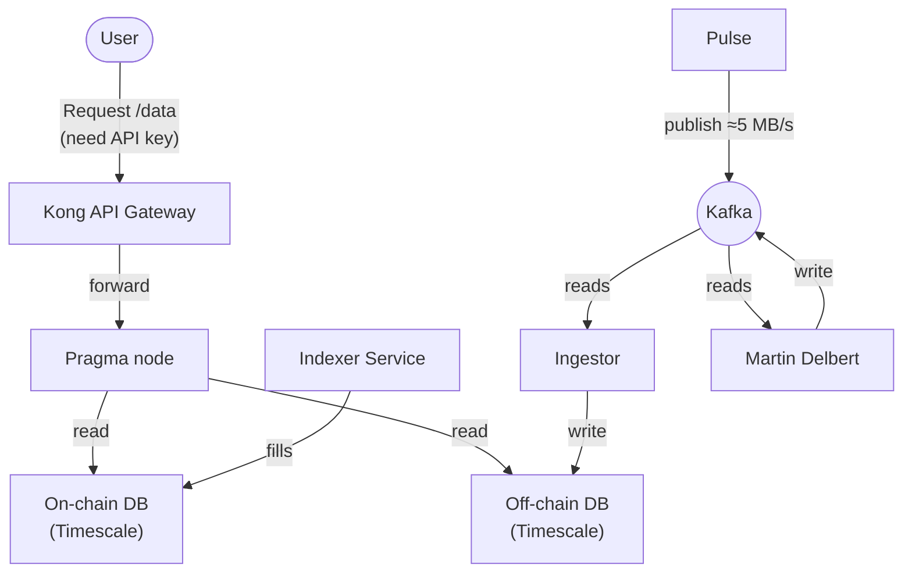

```mermaid
flowchart TD
    %% Nœuds principaux
    User(["User"])
    Kong["Kong API Gateway"]
    Pragma["Pragma node"]
    Indexer["Indexer Service"]
    OnchainDB["On-chain DB<br/>(Timescale)"]
    OffchainDB["Off-chain DB<br/>(Timescale)"]
    Pulse["Pulse"]
    Kafka(("Kafka"))         
    Ingestor["Ingestor"]
    Martin["Martin Delbert"]

    %% Relations côté requêtes utilisateur / lecture
    User -- "Request /data<br/>(need API key)" --> Kong
    Kong -- forward --> Pragma
    Pragma -- read --> OnchainDB
    Pragma -- read --> OffchainDB

    %% Remplissage on-chain
    Indexer -- fills --> OnchainDB

    %% Flux temps réel / off-chain
    Pulse -- "publish ≈5 MB/s" --> Kafka
    Kafka -- reads --> Ingestor
    Ingestor -- write --> OffchainDB

    %% Boucle interne Kafka ↔ Martin
    Kafka -- reads --> Martin
    Martin -- write --> Kafka
```