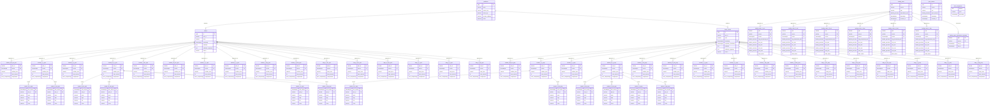

# Pragma Entities Database Schema

```mermaid
erDiagram
    publishers {
        uuid id PK
        varchar name
        varchar master_key
        varchar active_key
        varchar account_address
        boolean active
    }
    
    entries {
        uuid id PK
        varchar pair_id
        numeric price
        timestamptz timestamp PK
        text publisher
        text publisher_signature
        varchar source
    }
    
    future_entries {
        uuid id PK
        varchar pair_id
        numeric price
        timestamptz timestamp PK
        timestamptz expiration_timestamp
        text publisher
        text publisher_signature
        varchar source
    }
    
    funding_rates {
        uuid id PK
        varchar source
        varchar pair
        double_precision annualized_rate
        timestamptz timestamp PK
        timestamptz created_at
    }
    
    open_interest {
        uuid id PK
        varchar source
        varchar pair
        double_precision open_interest
        timestamptz timestamp PK
        timestamptz created_at
    }
    
    price_component {
        text source
        numeric price
        timestamptz timestamp
    }
    
    %% Median aggregates (spot)
    median_100_ms_spot {
        varchar pair_id PK
        timestamptz bucket PK
        numeric median_price
        int num_sources
        price_component[] components
    }
    
    median_1_s_spot {
        varchar pair_id PK
        timestamptz bucket PK
        numeric median_price
        int num_sources
        price_component[] components
    }
    
    median_5_s_spot {
        varchar pair_id PK
        timestamptz bucket PK
        numeric median_price
        int num_sources
        price_component[] components
    }
    
    median_10_s_spot {
        varchar pair_id PK
        timestamptz bucket PK
        numeric median_price
        int num_sources
        price_component[] components
    }
    
    median_1_min_spot {
        varchar pair_id PK
        timestamptz bucket PK
        numeric median_price
        int num_sources
        price_component[] components
    }
    
    median_15_min_spot {
        varchar pair_id PK
        timestamptz bucket PK
        numeric median_price
        int num_sources
        price_component[] components
    }
    
    median_1_h_spot {
        varchar pair_id PK
        timestamptz bucket PK
        numeric median_price
        int num_sources
        price_component[] components
    }
    
    median_2_h_spot {
        varchar pair_id PK
        timestamptz bucket PK
        numeric median_price
        int num_sources
        price_component[] components
    }
    
    median_1_day_spot {
        varchar pair_id PK
        timestamptz bucket PK
        numeric median_price
        int num_sources
        price_component[] components
    }
    
    median_1_week_spot {
        varchar pair_id PK
        timestamptz bucket PK
        numeric median_price
        int num_sources
        price_component[] components
    }
    
    %% Median aggregates (perp)
    median_100_ms_perp {
        varchar pair_id PK
        timestamptz bucket PK
        numeric median_price
        int num_sources
        price_component[] components
    }
    
    median_1_s_perp {
        varchar pair_id PK
        timestamptz bucket PK
        numeric median_price
        int num_sources
        price_component[] components
    }
    
    median_5_s_perp {
        varchar pair_id PK
        timestamptz bucket PK
        numeric median_price
        int num_sources
        price_component[] components
    }
    
    median_10_s_perp {
        varchar pair_id PK
        timestamptz bucket PK
        numeric median_price
        int num_sources
        price_component[] components
    }
    
    median_1_min_perp {
        varchar pair_id PK
        timestamptz bucket PK
        numeric median_price
        int num_sources
        price_component[] components
    }
    
    median_15_min_perp {
        varchar pair_id PK
        timestamptz bucket PK
        numeric median_price
        int num_sources
        price_component[] components
    }
    
    median_1_h_perp {
        varchar pair_id PK
        timestamptz bucket PK
        numeric median_price
        int num_sources
        price_component[] components
    }
    
    median_2_h_perp {
        varchar pair_id PK
        timestamptz bucket PK
        numeric median_price
        int num_sources
        price_component[] components
    }
    
    median_1_day_perp {
        varchar pair_id PK
        timestamptz bucket PK
        numeric median_price
        int num_sources
        price_component[] components
    }
    
    median_1_week_perp {
        varchar pair_id PK
        timestamptz bucket PK
        numeric median_price
        int num_sources
        price_component[] components
    }
    
    %% TWAP aggregates (spot)
    twap_1_min_spot {
        varchar pair_id PK
        timestamptz bucket PK
        numeric twap_price
        int num_sources
        price_component[] components
    }
    
    twap_5_min_spot {
        varchar pair_id PK
        timestamptz bucket PK
        numeric twap_price
        int num_sources
        price_component[] components
    }
    
    twap_15_min_spot {
        varchar pair_id PK
        timestamptz bucket PK
        numeric twap_price
        int num_sources
        price_component[] components
    }
    
    twap_1_h_spot {
        varchar pair_id PK
        timestamptz bucket PK
        numeric twap_price
        int num_sources
        price_component[] components
    }
    
    twap_2_h_spot {
        varchar pair_id PK
        timestamptz bucket PK
        numeric twap_price
        int num_sources
        price_component[] components
    }
    
    twap_1_day_spot {
        varchar pair_id PK
        timestamptz bucket PK
        numeric twap_price
        int num_sources
        price_component[] components
    }
    
    %% TWAP aggregates (perp)
    twap_1_min_perp {
        varchar pair_id PK
        timestamptz bucket PK
        numeric twap_price
        int num_sources
        price_component[] components
    }
    
    twap_5_min_perp {
        varchar pair_id PK
        timestamptz bucket PK
        numeric twap_price
        int num_sources
        price_component[] components
    }
    
    twap_15_min_perp {
        varchar pair_id PK
        timestamptz bucket PK
        numeric twap_price
        int num_sources
        price_component[] components
    }
    
    twap_1_h_perp {
        varchar pair_id PK
        timestamptz bucket PK
        numeric twap_price
        int num_sources
        price_component[] components
    }
    
    twap_2_h_perp {
        varchar pair_id PK
        timestamptz bucket PK
        numeric twap_price
        int num_sources
        price_component[] components
    }
    
    twap_1_day_perp {
        varchar pair_id PK
        timestamptz bucket PK
        numeric twap_price
        int num_sources
        price_component[] components
    }
    
    %% Candlestick views (spot)
    candle_10_s_spot {
        timestamptz ohlc_bucket PK
        varchar pair_id PK
        numeric open
        numeric high
        numeric low
        numeric close
    }
    
    candle_1_min_spot {
        timestamptz ohlc_bucket PK
        varchar pair_id PK
        numeric open
        numeric high
        numeric low
        numeric close
    }
    
    candle_5_min_spot {
        timestamptz ohlc_bucket PK
        varchar pair_id PK
        numeric open
        numeric high
        numeric low
        numeric close
    }
    
    candle_15_min_spot {
        timestamptz ohlc_bucket PK
        varchar pair_id PK
        numeric open
        numeric high
        numeric low
        numeric close
    }
    
    candle_1_h_spot {
        timestamptz ohlc_bucket PK
        varchar pair_id PK
        numeric open
        numeric high
        numeric low
        numeric close
    }
    
    candle_1_day_spot {
        timestamptz ohlc_bucket PK
        varchar pair_id PK
        numeric open
        numeric high
        numeric low
        numeric close
    }
    
    %% Candlestick views (perp)
    candle_10_s_perp {
        timestamptz ohlc_bucket PK
        varchar pair_id PK
        numeric open
        numeric high
        numeric low
        numeric close
    }
    
    candle_1_min_perp {
        timestamptz ohlc_bucket PK
        varchar pair_id PK
        numeric open
        numeric high
        numeric low
        numeric close
    }
    
    candle_5_min_perp {
        timestamptz ohlc_bucket PK
        varchar pair_id PK
        numeric open
        numeric high
        numeric low
        numeric close
    }
    
    candle_15_min_perp {
        timestamptz ohlc_bucket PK
        varchar pair_id PK
        numeric open
        numeric high
        numeric low
        numeric close
    }
    
    candle_1_h_perp {
        timestamptz ohlc_bucket PK
        varchar pair_id PK
        numeric open
        numeric high
        numeric low
        numeric close
    }
    
    candle_1_day_perp {
        timestamptz ohlc_bucket PK
        varchar pair_id PK
        numeric open
        numeric high
        numeric low
        numeric close
    }
    
    %% Funding rates aggregates
    funding_rates_1_min {
        varchar pair PK
        varchar source PK
        timestamptz bucket PK
        double_precision avg_annualized_rate
        double_precision first_rate
        double_precision last_rate
        double_precision min_rate
        double_precision max_rate
        int data_points
    }
    
    funding_rates_5_min {
        varchar pair PK
        varchar source PK
        timestamptz bucket PK
        double_precision avg_annualized_rate
        double_precision first_rate
        double_precision last_rate
        double_precision min_rate
        double_precision max_rate
        int data_points
    }
    
    funding_rates_15_min {
        varchar pair PK
        varchar source PK
        timestamptz bucket PK
        double_precision avg_annualized_rate
        double_precision first_rate
        double_precision last_rate
        double_precision min_rate
        double_precision max_rate
        int data_points
    }
    
    funding_rates_1_hour {
        varchar pair PK
        varchar source PK
        timestamptz bucket PK
        double_precision avg_annualized_rate
        double_precision first_rate
        double_precision last_rate
        double_precision min_rate
        double_precision max_rate
        int data_points
    }
    
    funding_rates_4_hour {
        varchar pair PK
        varchar source PK
        timestamptz bucket PK
        double_precision avg_annualized_rate
        double_precision first_rate
        double_precision last_rate
        double_precision min_rate
        double_precision max_rate
        int data_points
    }
    
    funding_rates_1_day {
        varchar pair PK
        varchar source PK
        timestamptz bucket PK
        double_precision avg_annualized_rate
        double_precision first_rate
        double_precision last_rate
        double_precision min_rate
        double_precision max_rate
        int data_points
    }
    
    %% Summary view
    funding_rates_instruments_summary {
        varchar pair PK
        varchar source PK
        timestamptz first_ts
        timestamptz last_ts
    }
    
    %% Relationships
    publishers ||--o{ entries : publishes
    publishers ||--o{ future_entries : publishes
    
    entries ||--o{ median_100_ms_spot : aggregates_to
    entries ||--o{ median_1_s_spot : aggregates_to
    entries ||--o{ median_5_s_spot : aggregates_to
    entries ||--o{ median_10_s_spot : aggregates_to
    entries ||--o{ median_1_min_spot : aggregates_to
    entries ||--o{ median_15_min_spot : aggregates_to
    entries ||--o{ median_1_h_spot : aggregates_to
    entries ||--o{ median_2_h_spot : aggregates_to
    entries ||--o{ median_1_day_spot : aggregates_to
    entries ||--o{ median_1_week_spot : aggregates_to
    
    entries ||--o{ twap_1_min_spot : aggregates_to
    entries ||--o{ twap_5_min_spot : aggregates_to
    entries ||--o{ twap_15_min_spot : aggregates_to
    entries ||--o{ twap_1_h_spot : aggregates_to
    entries ||--o{ twap_2_h_spot : aggregates_to
    entries ||--o{ twap_1_day_spot : aggregates_to
    
    future_entries ||--o{ median_100_ms_perp : aggregates_to
    future_entries ||--o{ median_1_s_perp : aggregates_to
    future_entries ||--o{ median_5_s_perp : aggregates_to
    future_entries ||--o{ median_10_s_perp : aggregates_to
    future_entries ||--o{ median_1_min_perp : aggregates_to
    future_entries ||--o{ median_15_min_perp : aggregates_to
    future_entries ||--o{ median_1_h_perp : aggregates_to
    future_entries ||--o{ median_2_h_perp : aggregates_to
    future_entries ||--o{ median_1_day_perp : aggregates_to
    future_entries ||--o{ median_1_week_perp : aggregates_to
    
    future_entries ||--o{ twap_1_min_perp : aggregates_to
    future_entries ||--o{ twap_5_min_perp : aggregates_to
    future_entries ||--o{ twap_15_min_perp : aggregates_to
    future_entries ||--o{ twap_1_h_perp : aggregates_to
    future_entries ||--o{ twap_2_h_perp : aggregates_to
    future_entries ||--o{ twap_1_day_perp : aggregates_to
    
    median_1_s_spot ||--o{ candle_10_s_spot : creates
    median_1_s_spot ||--o{ candle_1_min_spot : creates
    median_10_s_spot ||--o{ candle_5_min_spot : creates
    median_10_s_spot ||--o{ candle_15_min_spot : creates
    median_10_s_spot ||--o{ candle_1_h_spot : creates
    median_10_s_spot ||--o{ candle_1_day_spot : creates
    
    median_1_s_perp ||--o{ candle_10_s_perp : creates
    median_1_s_perp ||--o{ candle_1_min_perp : creates
    median_10_s_perp ||--o{ candle_5_min_perp : creates
    median_10_s_perp ||--o{ candle_15_min_perp : creates
    median_10_s_perp ||--o{ candle_1_h_perp : creates
    median_10_s_perp ||--o{ candle_1_day_perp : creates
    
    funding_rates ||--o{ funding_rates_1_min : aggregates_to
    funding_rates ||--o{ funding_rates_5_min : aggregates_to
    funding_rates ||--o{ funding_rates_15_min : aggregates_to
    funding_rates ||--o{ funding_rates_1_hour : aggregates_to
    funding_rates ||--o{ funding_rates_4_hour : aggregates_to
    funding_rates ||--o{ funding_rates_1_day : aggregates_to
    funding_rates ||--o{ funding_rates_instruments_summary : summarizes
```